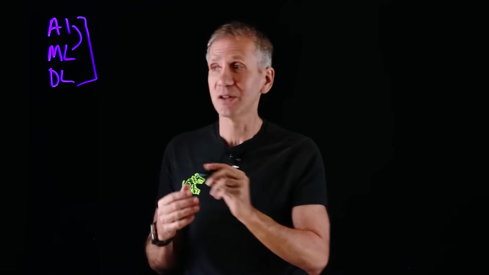
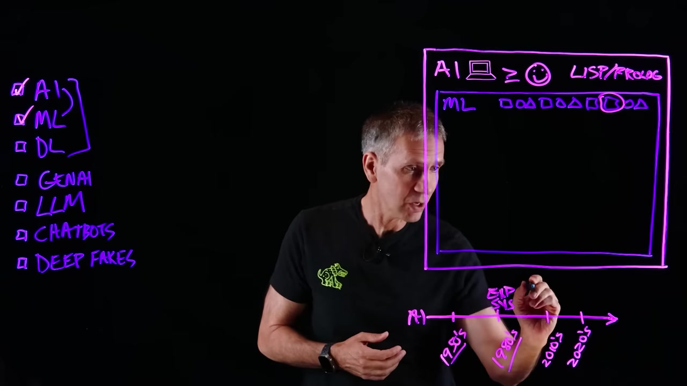
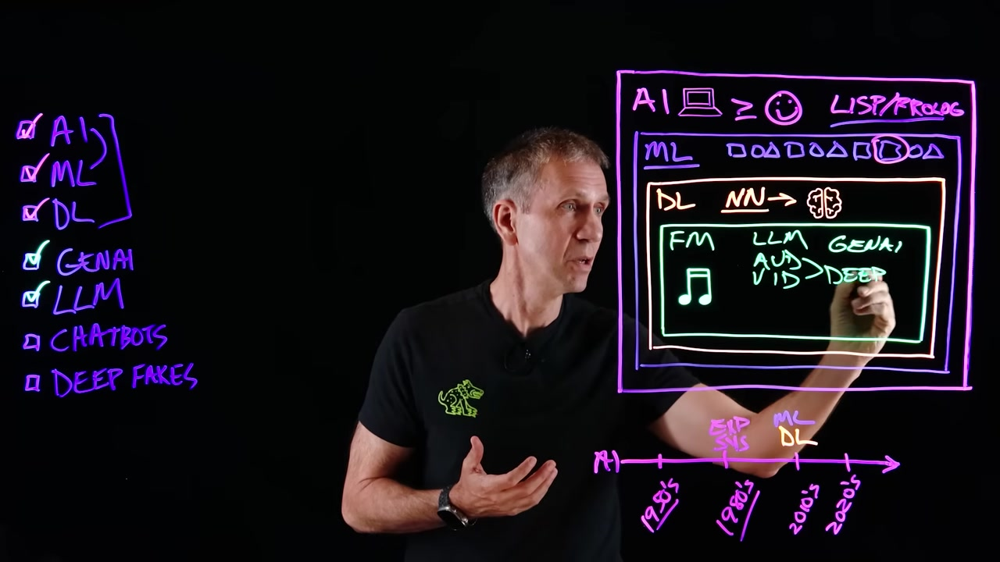
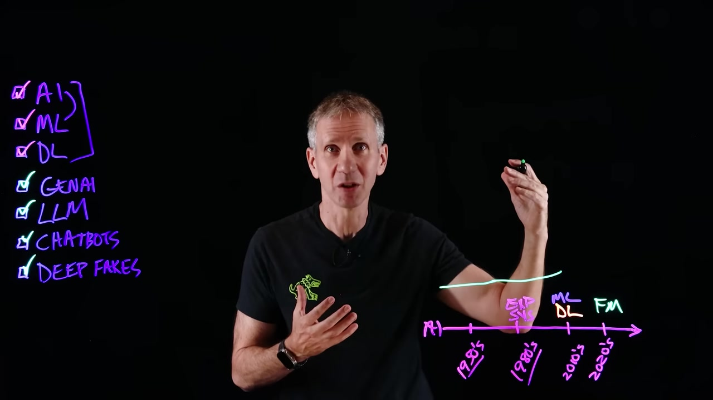

# Лабораторная работа 3 — Саммаризация короткого видео

## Цель работы

Получить практический опыт работы с мультимодальными моделями на задаче автоматической саммаризации короткого видео.

В рамках работы был реализован пайплайн обработки YouTube-ролика длительностью до 10 минут. Видео анализируется не только по аудиодорожке, но и по визуальному ряду: сначала строится транскрипт речи, затем извлекаются ключевые кадры, после чего кадры описываются визуально-языковой моделью. На основе полученных данных формируется структурированное саммари с таймкодами.

---

## Постановка задачи

Необходимо реализовать пайплайн мультимодальной саммаризации короткого YouTube-видео.

Общий пайплайн работы:

```text
YouTube-видео
→ Whisper
→ транскрипт с таймкодами
→ PySceneDetect
→ ключевые кадры
→ VLM BLIP
→ описания кадров
→ итоговое структурированное саммари
```

В качестве исходного видео был выбран короткий образовательный ролик про искусственный интеллект, машинное обучение, глубокое обучение и генеративный ИИ. Видео подходит для лабораторной работы, так как содержит речь, визуальные схемы, подписи на доске и объяснение нескольких связанных понятий.

---

## Используемые инструменты

В работе использовались следующие инструменты и модели:

```text
Google Colab — среда выполнения кода
yt-dlp — загрузка YouTube-видео
Whisper — распознавание речи и получение транскрипта
PySceneDetect — поиск сцен в видео
ffmpeg — извлечение ключевых кадров
BLIP — VLM-модель для описания изображений
Python — реализация пайплайна
```

Так как OpenAI API-ключ отсутствовал, финальное саммари было сформировано локально на основе полученного мультимодального контекста: таймкодов, транскрипта и описаний ключевых кадров.

---

## Структура проекта

```text
lab3/
├── README.md
├── lab3_video_summary.ipynb
└── outputs/
    ├── frames/
    │   ├── scene_001_00-37.jpg
    │   ├── scene_002_01-52.jpg
    │   ├── scene_003_03-07.jpg
    │   ├── scene_004_04-22.jpg
    │   ├── scene_005_05-37.jpg
    │   ├── scene_006_06-52.jpg
    │   ├── scene_007_08-07.jpg
    │   └── scene_008_09-22.jpg
    ├── frame_descriptions.json
    ├── report.md
    ├── scene_context.json
    ├── scenes.json
    ├── summary.md
    ├── transcript.json
    └── transcript.txt
```

---

## Ход работы

## 1. Загрузка видео

Сначала в Google Colab были установлены необходимые зависимости: `yt-dlp`, `openai-whisper`, `scenedetect`, `opencv-python`, `transformers`, `torch`, `pillow` и другие библиотеки.

После этого видео было скачано с YouTube с помощью `yt-dlp` и сохранено в рабочую директорию Google Colab.

Видео было сохранено по пути:

```text
/content/lab3_video_summary/data/video.mp4
```

После загрузки была проверена длительность видео. Видео укладывается в ограничение лабораторной работы — до 10 минут.

---

## 2. Получение транскрипта через Whisper

Следующим этапом аудиодорожка видео была обработана моделью Whisper.

Whisper вернул список текстовых сегментов с временными границами. Каждый сегмент содержит начало, конец и распознанный текст.

Пример первых фрагментов транскрипта:

```text
[00:00–00:03] Everybody's talking about artificial intelligence these days, AI.
[00:03–00:04] Machine learning is another hot topic.
[00:07–00:10] Are they the same thing or are they different?
[00:10–00:12] And if so, what are those differences?
```

Результаты транскрипции были сохранены в файлы:

```text
outputs/transcript.txt
outputs/transcript.json
```

Файл `transcript.txt` содержит человекочитаемый транскрипт с таймкодами, а `transcript.json` содержит данные в машинно-читаемом формате.

---

## 3. Детекция сцен через PySceneDetect

После получения транскрипта видео было передано в PySceneDetect для поиска смен сцен.

В данном видео PySceneDetect не обнаружил явных резких смен сцен:

```text
Сцен найдено PySceneDetect: 0
```

Это связано с тем, что ролик визуально достаточно статичный: спикер находится перед доской, а визуальные изменения происходят постепенно.

Чтобы продолжить пайплайн, было применено равномерное разбиение видео на 8 временных фрагментов:

```text
Сцена 1: 00:00–01:15
Сцена 2: 01:15–02:30
Сцена 3: 02:30–03:45
Сцена 4: 03:45–05:00
Сцена 5: 05:00–06:15
Сцена 6: 06:15–07:30
Сцена 7: 07:30–08:45
Сцена 8: 08:45–10:00
```

Такой подход позволил сохранить идею пайплайна: для каждого временного фрагмента был извлечён ключевой кадр и привязан соответствующий фрагмент транскрипта.

---

## 4. Извлечение ключевых кадров

Изначально для извлечения кадров использовался OpenCV, но в Google Colab кадры не извлекались корректно. Поэтому для более надёжной обработки был использован `ffmpeg`.

Из середины каждой сцены был извлечён один ключевой кадр.

Полученные кадры:

```text
outputs/frames/scene_001_00-37.jpg
outputs/frames/scene_002_01-52.jpg
outputs/frames/scene_003_03-07.jpg
outputs/frames/scene_004_04-22.jpg
outputs/frames/scene_005_05-37.jpg
outputs/frames/scene_006_06-52.jpg
outputs/frames/scene_007_08-07.jpg
outputs/frames/scene_008_09-22.jpg
```

---

## Примеры ключевых кадров

### Сцена 1 — 00:37



На первом ключевом кадре виден спикер на тёмном фоне. На доске присутствуют неоновые подписи и визуальные элементы, связанные с темой искусственного интеллекта.

---

### Сцена 4 — 04:22



На этом кадре спикер находится перед доской с неоновыми схемами. Визуальный ряд помогает понять, что объяснение строится вокруг взаимосвязи разных понятий из области искусственного интеллекта.

---

### Сцена 7 — 08:07



На кадре показана часть объяснения, связанная с современными направлениями ИИ, включая генеративный ИИ, чатботов и deep fakes.

---

### Сцена 8 — 09:22



На финальном фрагменте снова виден спикер и схема на доске. Визуально ролик сохраняет единый стиль: тёмный фон, неоновые надписи и графические блоки.

---

## 5. Описание кадров через VLM BLIP

После извлечения кадров каждый ключевой кадр был обработан визуально-языковой моделью BLIP.

BLIP сгенерировал текстовые описания изображений. Описания получились достаточно общими, но они отражают основную визуальную сцену: человек стоит или пишет перед доской с неоновыми надписями.

Примеры описаний:

```text
Сцена 1 [00:37]: a man in a black shirt is holding a green object
Сцена 2 [01:52]: a man is standing in front of a blackboard with neons
Сцена 3 [03:07]: a man is writing on a blackboard
Сцена 4 [04:22]: a man is standing in front of a blackboard with neon writing
Сцена 5 [05:37]: a man standing in front of a blackboard with neon writing
Сцена 6 [06:52]: a man is standing in front of a blackboard with neon writing
Сцена 7 [08:07]: a man is writing on a blackboard
Сцена 8 [09:22]: a man is standing in front of a blackboard with neon writing
```

Результаты работы VLM были сохранены в файл:

```text
outputs/frame_descriptions.json
```

---

## 6. Объединение транскрипта и визуальных описаний

На следующем этапе для каждой сцены был сформирован объединённый мультимодальный контекст.

Каждый фрагмент содержит:

```text
номер сцены
таймкод
описание ключевого кадра
фрагмент транскрипта
```

Пример объединённого контекста:

```text
Сцена 1: 00:00–01:15
Описание ключевого кадра: a man in a black shirt is holding a green object
Транскрипт сцены: Everybody's talking about artificial intelligence these days, AI. Machine learning is another hot topic. Are they the same thing or are they different?
```

Объединённый контекст был сохранён в файл:

```text
outputs/scene_context.json
```

---

## 7. Итоговое саммари

Итоговое саммари было сформировано на основе полученных данных: транскрипта Whisper, ключевых кадров и описаний BLIP.

Полная версия саммари находится в файле:

```text
outputs/summary.md
```

Ниже приведена краткая версия результата.

---

## Краткое содержание видео

Видео посвящено объяснению различий между искусственным интеллектом, машинным обучением, глубоким обучением, генеративным ИИ, большими языковыми моделями, чатботами и дипфейками. Автор объясняет, что искусственный интеллект является широким понятием, внутри которого находятся разные подходы и технологии.

Машинное обучение рассматривается как способ обучать модель на данных, чтобы она могла делать прогнозы. Глубокое обучение связывается с нейронными сетями и имитацией принципов работы человеческого мозга. Генеративный ИИ выделяется как современное направление, способное создавать новый контент на основе уже существующих данных.

---

## Основные тезисы

Искусственный интеллект является общей областью, включающей множество разных технологий.

Машинное обучение является одним из подходов внутри искусственного интеллекта.

Модель машинного обучения обучается на данных и затем использует этот опыт для прогнозирования.

Глубокое обучение связано с нейронными сетями и более сложными архитектурами обработки данных.

Большие языковые модели являются примером современных foundation models.

Генеративный ИИ может создавать новый контент: текст, музыку, изображения и другие данные.

Визуальный ряд помогает понять структуру объяснения, так как на доске показаны схемы и ключевые понятия.

---

## Хронология с таймкодами

| Таймкод | Что происходит | Что говорится | Визуальные признаки |
|---|---|---|---|
| 00:00–01:15 | Начало объяснения темы искусственного интеллекта. | Автор вводит понятия AI и machine learning, задаёт вопрос о том, одинаковые это вещи или разные. | Спикер находится перед тёмной доской с неоновыми подписями. |
| 01:15–02:30 | Упрощение терминов и переход к базовым понятиям. | Автор объясняет, что для понимания темы нужно упростить некоторые концепции. | Спикер стоит перед доской с неоновыми схемами. |
| 02:30–03:45 | Объяснение ранних систем и предпосылок развития ИИ. | Упоминаются предшественники экспертных систем и ранние технологии. | Спикер пишет или показывает элементы на доске. |
| 03:45–05:00 | Объяснение машинного обучения. | Автор говорит, что чем больше обучающих данных получает модель, тем увереннее она может делать прогнозы. | На экране виден спикер и неоновые надписи на доске. |
| 05:00–06:15 | Переход к нейронным сетям и глубокому обучению. | Объясняется, что нейронные сети имитируют работу человеческого мозга. | Визуально сохраняется формат лекции у доски. |
| 06:15–07:30 | Объяснение больших языковых моделей и foundation models. | Автор приводит пример large language model как модели, работающей с языком и прогнозированием. | Спикер находится перед доской с надписями и схемами. |
| 07:30–08:45 | Объяснение генеративного ИИ. | Автор говорит о создании нового контента на основе уже существующей информации. | На доске появляются подписи, связанные с современными ИИ-технологиями. |
| 08:45–10:00 | Завершение объяснения и обобщение. | Обсуждаются возможности генерации нового контента и суммаризации существующей информации. | Видна схема с AI, ML, DL, foundation models и generative AI. |

---

## Мультимодальный анализ

Транскрипт, полученный с помощью Whisper, дал основную смысловую информацию о видео. Именно из транскрипта можно понять, какие понятия объясняет автор, как он связывает AI, machine learning, deep learning, large language models и generative AI.

Визуальная часть, обработанная через BLIP, дала дополнительную информацию о том, что происходит на экране. Описания кадров показали, что видео построено как объяснение у доски: спикер находится на фоне чёрной доски с неоновыми надписями и схемами. Хотя BLIP описывает кадры достаточно обобщённо, эти описания всё равно подтверждают, что визуальный ряд соответствует содержанию лекции.

PySceneDetect не обнаружил явных смен сцен, поэтому видео было равномерно разделено на 8 фрагментов. Это решение позволило сохранить логику лабораторной работы и получить ключевые кадры для дальнейшего анализа.

---

## Полученные результаты

В результате выполнения работы были получены следующие файлы:

```text
outputs/transcript.txt
outputs/transcript.json
outputs/scenes.json
outputs/frame_descriptions.json
outputs/scene_context.json
outputs/summary.md
outputs/report.md
outputs/frames/
```

Файл `transcript.txt` содержит транскрипт с таймкодами.  
Файл `scenes.json` содержит информацию о сценах и ключевых кадрах.  
Файл `frame_descriptions.json` содержит описания кадров, полученные с помощью BLIP.  
Файл `scene_context.json` содержит объединённый мультимодальный контекст.  
Файл `summary.md` содержит итоговое структурированное саммари.  
Папка `frames` содержит ключевые кадры из видео.

---

---

## Вывод

В ходе лабораторной работы был реализован пайплайн мультимодальной саммаризации короткого видео. Сначала видео было загружено и обработано моделью Whisper для получения транскрипта. Затем была выполнена попытка выделения сцен через PySceneDetect. Так как явных смен сцен найдено не было, видео было равномерно разделено на 8 фрагментов.

Для каждого фрагмента был извлечён ключевой кадр с помощью ffmpeg. Далее кадры были обработаны VLM-моделью BLIP, которая сформировала текстовые описания изображений. После этого транскрипт и визуальные описания были объединены в общий мультимодальный контекст.

Работа показала, что мультимодальный подход позволяет получить более полное представление о видео, чем анализ только аудиодорожки. Текстовая часть показывает содержание речи, а визуальная часть помогает понять, что отображается на экране и как построено объяснение.

---
